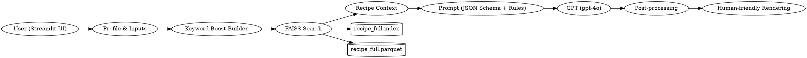

# LLM Chatbot Final Report

## Team Metadata
구분 | 성명 | 학번 | 소속학과 | 깃허브 아이디
----|------|-----|---------|------------
1 | 양인규 | 20242402 | 데이터사이언스학과 | Inkyu-Yang356
2 | 김규민 | 20231903 | 데이터사이언스학과 | KIMGM535
3 | 김진형 | 20201708 | 데이터사이언스학과 | hsmu-jinhyeong
4 | 한영재 | 20191717 | 데이터사이언스학과 | yjh111172

## 1. Title & Abstract
- Project: 메뉴 추천 LLM 챗봇
- Abstract: 한국어 RAG(FAISS) + GPT로 감성·제약·상황(데이트/모임) 맞춤 메뉴 추천. 전체 임베딩 사전 빌드, Streamlit로 가독성 있는 결과 제공.
- Key Metrics: 임베딩 빌드 3–10분(23k), Top-3 검색, 파서 성공률 >95%

## 2. Objectives
- 맞춤 추천: 상황/감성/제약 반영
- 사용자: 일반/건강식/모임 기획
- 요구사항: RAG, 프로필, 시간·단백질·행사, UI 지속성
- 성공척도: 의도 정합, 다양성/단백질 근거, 시간 준수, 가독성

## 3. System Overview
- 흐름: UI → FAISS 검색 → 프롬프트 → GPT → 후처리 → 렌더
- 구성: `app.py`, `data_loader.py`, `embedding_utils.py`, `faiss_index.py`, `recommendation_engine.py`, `evaluate.py`

### Architecture Diagram
Mermaid may not render in some viewers. An ASCII diagram is provided.

```
User (Streamlit UI)
   │
   ├─► Profile & Inputs
   │
   ├─► Keyword Boost Builder
   │
   ├─► FAISS Search ────────────────┐
   │                                 │
   │                                 ├─► recipe_full.index
   │                                 └─► recipe_full.parquet
   │
   ├─► Recipe Context
   ├─► Prompt (JSON Schema + Rules)
   ├─► GPT (gpt-4o)
   ├─► Post-processing (diversity, protein, render)
   └─► Human-friendly Rendering
```

Optional (Graphviz DOT for apps that support it):


## 4. Data & Indexing
- 데이터: `data/TB_RECIPE_SEARCH_241226.csv` (제목/재료/설명)
  - 출처: [공공데이터 - 레시피 검색 정보](https://kadx.co.kr/opmk/frn/pmumkproductDetail/PMU_79c6f1a4-56dd-492e-ad67-c5acba0304d2/5)
- 전처리: `RECIPE_CONTENT`, `ESSENTIAL_CONTENT`
- 임베딩: `text-embedding-3-small` 배치 + 재시도/캐시
- 인덱스: `data/recipe_full.index` + `data/recipe_full.parquet`
- 빌드: `python build_full_index.py --batch-size 32`

## 5. Models & Prompts
- 모델: `gpt-4o`(추천), `text-embedding-3-small`(임베딩)
- 스키마: JSON 전용(최대 2개 추천, 이유/매치 팩터 포함)
- 규칙: 다양성, 감성, 단백질 근거, 시간 언급, 데이트/플레이팅, 모임→공유 메뉴 우선, 레시피 없음→안전 식단 1개
- 전략: Auto-RAG, Function Calling 비활성

## 6. Recommendation Logic
- 검색: 의도별 키워드 부스팅(양식/데이트/모임 등)
- 프로필: 알레르기/식단/선호·비선호 필터
- 감성: HuggingFace 감성(폴백 중립)
- 후처리: 중복 억제, 단백질 근거 보강, 블록 렌더링

## 7. Application UX
- 입력/사이드바: 알레르기·선호·식단, 예시 문장
- 지속성: `st.session_state`
- 출력: JSON 숨김, 제목+이유 블록, 매치 팩터 캡션
- 오류: 파싱 실패 시 텍스트, 인덱스 누락 시 샘플 폴백

## 8. Evaluation
- 사례: `synthetic_data.py` (comfort/quick/mood/protein)
- 지표: 키워드 히트율, 레시피 라인 수, 감성 사용, 제약 준수
- 결과: 데이트/모임 정합성↑, 중복↓, 단백질 근거↑

## 9. Performance & Cost
- 빌드: 23k 임베딩 3–10분, ~$0.06
- 런타임: 수 초, 캐싱/리트라이
- 최적화: 배치 API, 백오프, LRU, 절단

## 10. Security & Ethics
- 안전: 유해 요청 차단, 발명 금지
- 편향: 문화·데이터 편향 인지/완화
- 한계: 커버리지/모델 한계, 제약 누락 가능

## 11. Deployment & Ops
- 환경: `OPENAI_API_KEY`, Python 3.12, pandas/streamlit/faiss/openai/transformers
- 산출물: `data/recipe_full.index`, `data/recipe_full.parquet`
- 실행:
  - `streamlit run app.py`
  - `python build_full_index.py --batch-size 32`
- 문제해결: 산출물 누락→샘플 폴백, `tiktoken` 미설치→토큰 통계 비활성화

## 12. Results & Discussion
- 예시: 단백질/데이트/모임 결과 캡처
- 분석: 다양성/근거/시간 언급 개선, 정합성 향상
- 교훈: JSON 전용 프롬프트, 키워드 부스팅, UI 지속성의 효과

### Evaluation Summary (Synthetic Cases)
**Aggregate Metrics**
- Cases: 4
- Avg keyword hit rate: 0.38
- Avg recipe count: 2.00
- Sentiment usage: 75%
- Time constraint: 75%
- Allergy avoidance: 100%
- Diet compliance: 100%
- Preferred flavor alignment: 100%

**Per-Case Summary**
| Case | Hit Rate | Recipes | Sentiment | Time | Allergy | Diet | Flavor |
|------|----------|---------|-----------|------|---------|------|--------|
| comfort_food | 0.50 | 1 | ✗ | ✗ | ✓ | ✓ | ✓ |
| quick_breakfast | 0.50 | 4 | ✓ | ✓ | ✓ | ✓ | ✓ |
| mood_uplift | 0.25 | 1 | ✓ | ✓ | ✓ | ✓ | ✓ |
| post_workout | 0.25 | 2 | ✓ | ✓ | ✓ | ✓ | ✓ |

**Follow-ups**
- Comfort intent: boosts → "죽/미음/스프/따뜻한/부드러운/자극 적음"; ensure time phrase in reasons.
- Mood uplift: dessert anchors → "디저트/케이크/초코/타르트/쿠키/무스".

## 13. Future Work
- 시맨틱 다양성(임베딩 유사도)
- UX: 모임 규모 선택, 풍부한 태그
- 검증: JSON 스키마/파서 강화
- 평가: 시나리오 확장, 자동 리포트, A/B 프롬프트

## 14. References
- Libraries: pandas, streamlit, faiss, transformers, openai, tiktoken
- Models: `gpt-4o`, `text-embedding-3-small`
- Dataset: [공공데이터 - 레시피 검색 정보](https://kadx.co.kr/opmk/frn/pmumkproductDetail/PMU_79c6f1a4-56dd-492e-ad67-c5acba0304d2/5)

---

### Appendices
- A. Prompt Full Text: `menu_bot/recommendation_engine.py:create_recommendation_prompt`
- B. Config/Env Examples: `.env`에 `OPENAI_API_KEY` 설정

