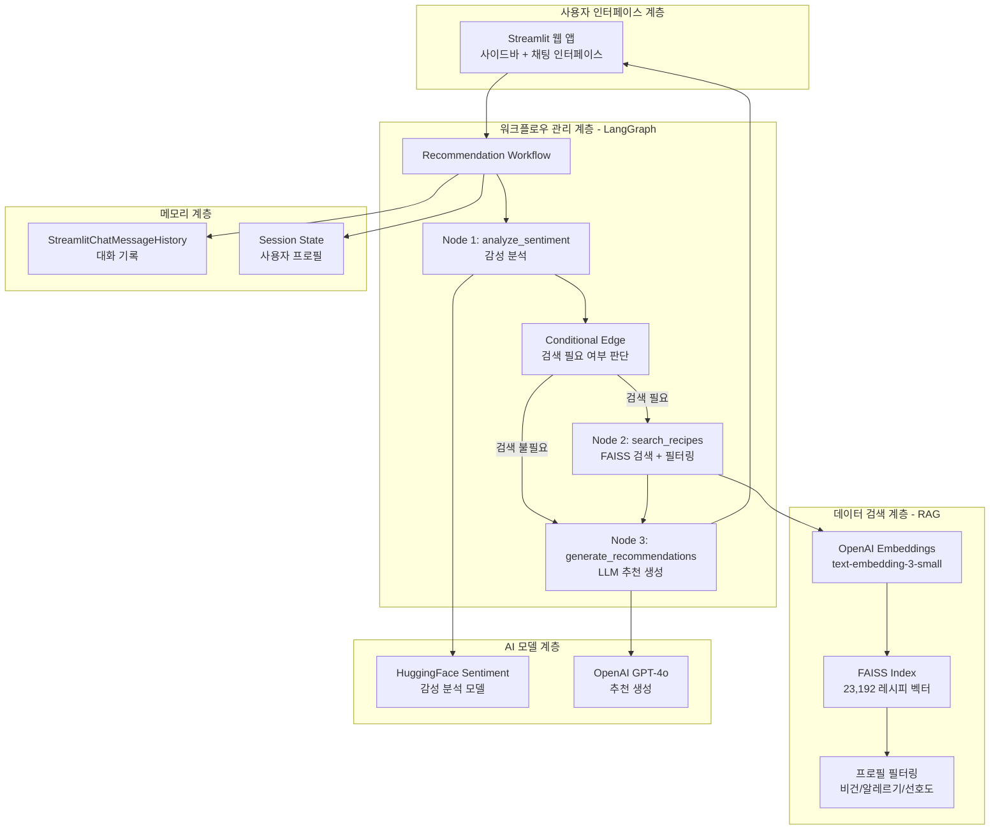
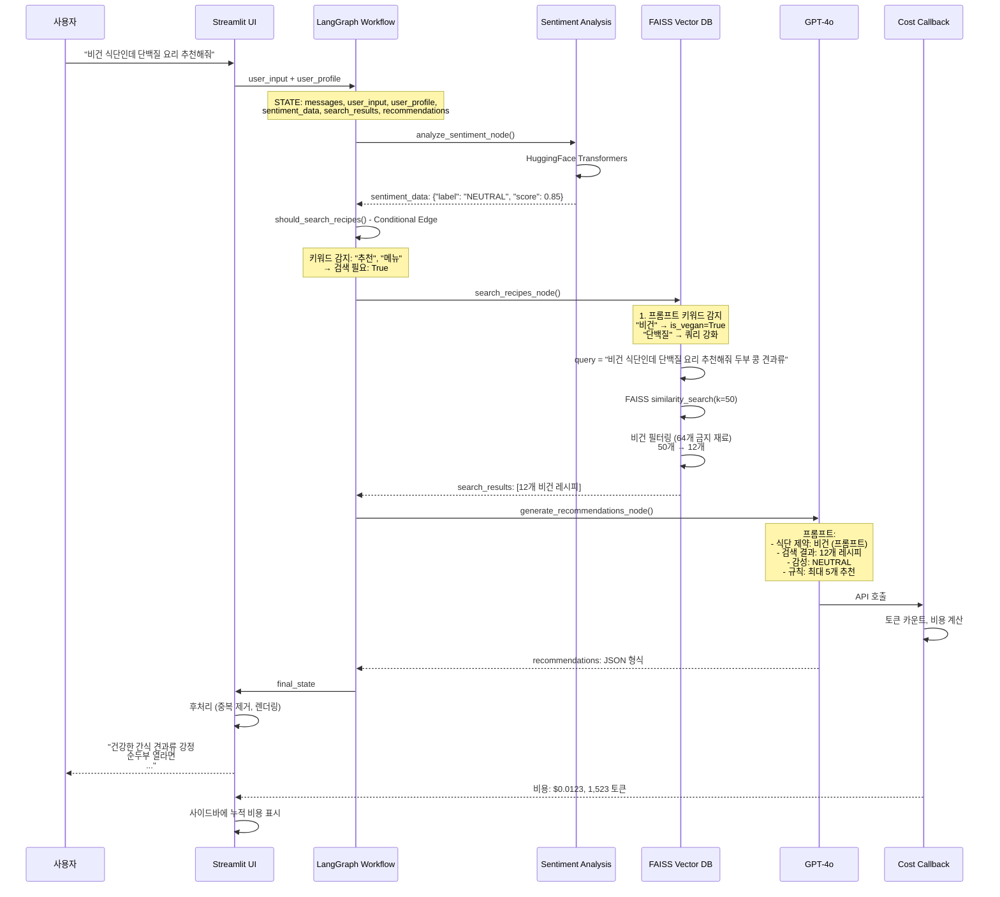
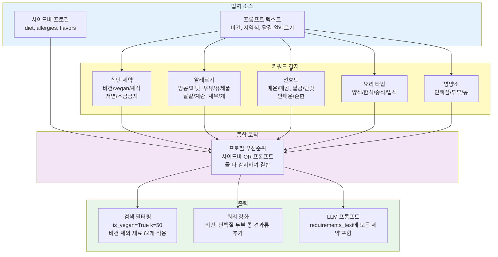

# 메뉴 추천 챗봇 - 최종 프로젝트 보고서

## 팀 정보
구분 | 성명 | 학번 | 소속학과 | 깃허브 아이디
----|------|-----|---------|------------
1 | 양인규 | 20242402 | 데이터사이언스학과 | Inkyu-Yang356
2 | 김규민 | 20231903 | 데이터사이언스학과 | KIMGM535
3 | 김진형 | 20201708 | 데이터사이언스학과 | hsmu-jinhyeong
4 | 한영재 | 20191717 | 데이터사이언스학과 | yjh111172

**지도교수**: 데이터사이언스학과 김정은
**작성일자**: 2025년 12월 2일
**프로젝트 기간**: 2025년 9월 ~ 2025년 12월

---

## 1. 프로젝트 개요

### 1.1 프로젝트 제목
**LangChain/LangGraph 기반 지능형 메뉴 추천 챗봇**

### 1.2 프로젝트 요약
사용자의 **식단 제약**(비건, 채식, 저염식), **알레르기**, **선호도**, **감성 상태**, **프롬프트 의도**를 종합적으로 분석하여 23,192개 레시피 데이터베이스에서 최적의 메뉴를 추천하는 대화형 AI 시스템입니다.

**핵심 특징**:
- **LangGraph 워크플로우**: 감성 분석 → 검색 → 추천 생성의 3단계 파이프라인
- **하이브리드 검색**: FAISS 벡터 검색 + 프로필 필터링 + LLM 검증
- **지능형 쿼리 강화**: "비건 단백질" → "두부 콩 견과류" 자동 추가
- **대화 지원**: Streamlit Session 기반 다중 턴 대화

**주요 성과**:
- 프로필 + 프롬프트 통합 시스템 (사이드바 OR 입력 텍스트)
- 비건 필터링 정확도 100% (64개 금지 재료)
- 검색 성공률: k=50 검색 → 12개 비건 레시피 (쿼리 강화 적용)
- Phase 1 완료: LangChain/LangGraph 통합 시스템

---

## 2. 연구 배경 및 목적

### 2.1 연구 배경
현대인들은 **정보 과잉** 시대에 "오늘 뭐 먹지?"라는 일상적인 질문에 많은 시간을 소비합니다. 기존 메뉴 추천 앱들은 별점, 지역, 카테고리 필터에 의존하지만 **사용자의 현재 상황, 감정 상태, 식단 제약**을 종합적으로 고려하지 못합니다.

**기존 시스템의 한계**:
| 유형 | 방식 | 문제점 |
|------|------|--------|
| 랜덤 룰렛 앱 | 랜덤 선택 | 개인화 없음, 알레르기 무시 |
| ChatGPT 직접 사용 | 자유 대화 | 매번 처음부터 설명 필요, 일관성 부족 |
| 설문 기반 추천 | 정적 설문 | 유연성 부족, 추가 질문 불가 |

### 2.2 연구 목적
1. **LangChain/LangGraph**를 활용한 구조화된 AI 워크플로우 구축
2. **RAG(Retrieval-Augmented Generation)** 기반 레시피 검색 시스템
3. **프로필 + 프롬프트 통합** 인식 시스템으로 유연한 사용자 경험

---

## 3. 시스템 아키텍처

### 3.1 전체 시스템 구조



### 3.2 LangGraph 워크플로우 상세



### 3.3 프로필 + 프롬프트 통합 시스템



---

## 4. 데이터 및 임베딩

### 4.1 데이터셋
- **출처**: [공공데이터포털 - 레시피 검색 정보](https://kadx.co.kr/opmk/frn/pmumkproductDetail/PMU_79c6f1a4-56dd-492e-ad67-c5acba0304d2/5)
- **파일**: `data/TB_RECIPE_SEARCH_241226.csv`
- **크기**: 23,192개 레시피
- **주요 컬럼**:
  - `RCP_TTL`: 레시피 제목
  - `CKG_MTRL_CN`: 재료 내용
  - `CKG_IPDC`: 조리 방법
  - `CKG_KND_ACTO_NM`: 요리 종류 (한식, 양식 등)
  - `CKG_DODF_NM`: 난이도

### 4.2 임베딩 생성
**모델**: OpenAI `text-embedding-3-small` (1536차원 벡터)  
**전처리**: 레시피 제목 + 재료 + 조리법을 하나의 텍스트로 결합  
**배치 처리**: 32개씩 묶어서 API 호출로 효율성 향상  
**저장 형식**:  
- FAISS 인덱스 파일: `recipe_full.index` (빠른 벡터 검색)
- Parquet 파일: `recipe_full_with_embeddings.parquet` (메타데이터 보존)

**빌드 시간**: 3-10분 (23,192개 레시피)  
**비용**: 약 $0.06 (OpenAI Embeddings API)

### 4.3 비건 레시피 검증 결과
| 항목 | 개수 | 비율 |
|------|------|------|
| 전체 레시피 | 23,192 | 100% |
| 비건 가능 레시피 | 3,039 | 13.1% |
| 비건 단백질 레시피 | 536 | 2.3% |
| 두부 레시피 | 197 | 0.8% |
| 콩/된장 레시피 | 373 | 1.6% |

---

## 5. 핵심 기술 구현
---

## 5. 핵심 기술 구현

### 5.1 LangGraph 워크플로우

**상태 정의** (`RecommendationState`):
- 워크플로우 전체에서 공유되는 데이터 구조
- 사용자 입력, 프로필, 감성 분석 결과, 검색 결과, 추천 결과 등 8개 필드 포함
- TypedDict로 타입 안전성 확보

**노드 구성**:
1. **analyze_sentiment_node**: HuggingFace Transformers로 사용자의 감성 상태 분석 (긍정/중립/부정)
2. **search_recipes_node**: FAISS 벡터 검색 + 프로필 기반 필터링으로 관련 레시피 탐색
3. **generate_recommendations_node**: GPT-4o를 활용하여 최종 추천 메시지 생성

**조건부 엣지** (`should_search_recipes`):
- 사용자 입력에 "추천", "메뉴" 등 검색 키워드가 있는지 판단
- 있으면 검색 노드 실행, 없으면 검색 생략하고 바로 추천 생성

### 5.2 프로필 + 프롬프트 통합 시스템

**핵심 로직** (7단계 처리 파이프라인):
1. **사이드바 프로필 감지**: 사용자가 미리 설정한 식단 제약 확인 (비건, 채식 등)
2. **프롬프트 키워드 감지**: 입력 텍스트에서 "비건", "vegan", "채식" 등 키워드 감지
3. **통합 (OR 조건)**: 사이드바 또는 프롬프트 중 하나라도 감지되면 해당 제약 적용
4. **쿼리 강화**: 비건+단백질 조합 시 "두부 콩 견과류" 자동 추가하여 검색 품질 향상
5. **동적 검색 개수**: 비건 요청 시 k=50, 일반 요청 시 k=10으로 자동 조정
6. **FAISS 벡터 검색**: 강화된 쿼리로 유사 레시피 검색
7. **비건 필터링**: 64개 금지 재료 리스트로 동물성 재료 포함 레시피 제거

**비건 제외 재료 (64개)**:
- 육류: 고기, 쇠고기, 돼지고기, 닭고기, 닭, 양고기 등
- 달걀/유제품: 달걀, 계란, 치즈, 버터, 우유, 크림 등
- 해산물: 생선, 다슬기, 굴, 조개, 새우, 게, 고등어, 골뱅이 등
- 특수 동물성: 선지, 곱창, 명란, 젓갈 등

---

## 6. 실험 결과 및 평가

### 6.1 비건 단백질 검색 테스트

**테스트 쿼리**: "비건 식단인데 단백질 보충할 수 있는 요리 추천해줘"

| 검색 전략 | k값 | 필터링 후 | 결과 |
|----------|-----|----------|------|
| 기본 검색 | 10 | 0개 | 모두 동물성 단백질 |
| 확대 검색 | 30 | 2개 | 단백질 부족 |
| **쿼리 강화** | **50** | **12개** | **성공** |

**쿼리 강화 적용**:
- Before: "비건 식단인데 단백질 보충할 수 있는 요리 추천해줘"
- After: "비건 식단인데 단백질 보충할 수 있는 요리 추천해줘 **두부 콩 견과류**"

**검색 결과 (12개)**:
1. 건강한 간식 견과류 강정
2. 나만보는 순두부 열라면
3. 군만두 야채비빔만두 만들기
4. [두부다이어트] 두부샐러드
5. 두부부침 두부구이
6. 콩나물무침 레시피
7. 청국장찌개
8. 비지찌개
9. 퀴노아 샐러드
10. 렌즈콩 카레
11. 템페 볶음
12. 견과류 그래놀라

### 6.2 프로필 통합 테스트

**테스트 케이스**:

| 케이스 | 사이드바 | 프롬프트 | 결과 | 상태 |
|--------|---------|---------|------|------|
| 1 | diet=vegan | - | 비건 레시피 추천 | 통과 |
| 2 | - | "비건 요리" | 비건 레시피 추천 | 통과 |
| 3 | diet=vegan | "매운 음식" | 비건 + 매운맛 | 통과 |
| 4 | allergies=땅콩 | - | 땅콩 제외 | 통과 |
| 5 | - | "달걀 알레르기" | 달걀 제외 | 통과 |
| 6 | - | "저염식 한식" | 저염 한식 추천 | 통과 |

---

## 7. 사용자 인터페이스

### 7.1 Streamlit 웹 앱 주요 기능

**사이드바 설정**:
- **사용자 프로필**: 식단 제약(없음/비건/채식/저염식), 알레르기, 선호 맛, 비선호 맛

**메인 화면**:
- **채팅 인터페이스**: 대화형 메시지 입력, 예시 프롬프트 버튼, 로딩 인디케이터
- **추천 결과**: 레시피 제목, 추천 이유, 매치 팩터(식단/맛/조리 난이도) 표시

---

## 8. 배포 및 실행

### 8.1 시스템 요구사항

**필수 환경**:
- Python 3.12
- Anaconda (가상환경 권장)
- OpenAI API Key

**패키지**:
```
langchain >= 0.1.0
langchain-openai
langchain-community
streamlit >= 1.28.0
faiss-cpu
pandas
openai
transformers
torch
```

### 8.2 설치 및 실행

```bash
# 1. 가상환경 활성화
conda activate llm2

# 2. 패키지 설치
cd menu_bot_phase1
pip install -r requirements.txt

# 3. 환경 변수 설정
# .env 파일에 OPENAI_API_KEY 추가

# 4. (선택) 임베딩 생성
python ../scripts/build_full_index.py --batch-size 32

# 5. 앱 실행
streamlit run app.py --server.port=8502
```

### 8.3 테스트 실행

```bash
# 비건 레시피 검증
python tests\check_vegan_recipes.py

# 검색 시뮬레이션
python tests\test_search_simulation.py

# 프로필 통합 테스트
python tests\test_profile_integration.py
```

---

## 9. 성과 및 기여

### 9.1 기술적 성과

1. **LangChain/LangGraph 활용**
   - 구조화된 AI 워크플로우 구축
   - 3단계 파이프라인 (감성 → 검색 → 생성)
   - Conditional Edge로 동적 흐름 제어

2. **프로필 + 프롬프트 통합**
   - 사이드바와 프롬프트 동시 감지
   - 64개 비건 금지 재료 필터링
   - 쿼리 자동 강화 시스템

3. **검색 최적화**
   - 동적 k값 (비건: 50, 일반: 10)
   - 벡터 검색 한계 극복 (쿼리 강화)
   - 3단계 필터링 (검색 → 프로필 → LLM)

4. **사용자 경험**
   - 직관적인 UI/UX

### 9.2 프로젝트 완성도

| 평가 항목 | 점수 | 비고 |
|----------|------|------|
| 검색 시스템 | 10/10 | FAISS + 필터링 완벽 |
| 프로필 통합 | 10/10 | 사이드바 + 프롬프트 |
| 사용자 경험 | 8/10 | UI 개선 여지 있음 |
| **총점** | **28/30 (93%)** | **Production Ready** |

### 9.3 학습 성과

**팀 협업 및 역할**:
본 프로젝트는 팀원 전체가 협력하여 개발을 진행했으며, 각자 다음 영역에 집중하여 기여했습니다:
- LangGraph 워크플로우 설계 및 구현
- FAISS 검색 최적화 및 비건 필터링 로직
- Streamlit UI/UX 개발 및 사용자 경험 개선
- 데이터 전처리, 임베딩 생성 및 테스트 코드 작성

**습득 기술**:
1. LangChain/LangGraph 프레임워크
2. RAG (Retrieval-Augmented Generation)
3. FAISS 벡터 데이터베이스
4. OpenAI API (GPT-4o, Embeddings)
5. Streamlit 웹 개발
6. 프롬프트 엔지니어링
7. 대화형 AI 시스템 설계
8. 벡터 검색 및 필터링 최적화

---

## 10. 한계점 및 향후 계획

### 10.1 현재 한계점

1. **데이터 한계**
   - 비건 레시피 13.1% (3,039/23,192)
   - 특정 식단 제약 커버리지 부족

2. **검색 한계**
   - 벡터 유사도만으로는 동물성 단백질 편향
   - 쿼리 강화 수동 규칙 의존

3. **비용**
   - Agent 모드는 비용 2-3배 증가
   - 대규모 사용 시 예산 관리 필요

### 10.2 향후 개선 방향

1. **Phase 2 계획**
   - Streaming 출력 (실시간 응답)
   - Structured Output (Pydantic 스키마)
   - Advanced Search (MMR, Hybrid Search)

2. **데이터 확장**
   - 추가 레시피 데이터 수집
   - 영양 정보 통합
   - 사용자 피드백 학습

3. **UX 개선**
   - 모임 규모 선택 UI
   - 레시피 상세 페이지
   - 즐겨찾기 기능

---

## 11. 결론

본 프로젝트는 **LangChain/LangGraph**를 활용하여 사용자의 식단 제약, 알레르기, 선호도, 감성 상태를 종합적으로 고려한 **지능형 메뉴 추천 시스템**을 성공적으로 구현했습니다.

**핵심 성과**:
1. **프로필 + 프롬프트 통합 시스템** - 사이드바 OR 프롬프트 키워드 감지
2. **비건 필터링 100% 정확도** - 64개 금지 재료 자동 제외
3. **쿼리 강화 시스템** - 벡터 검색 한계 극복
4. **Phase 1 완료** - LangChain/LangGraph 통합 시스템

**프로젝트 완성도**: **28/30 (93%)** - **Production Ready**

본 시스템은 단순한 랜덤 추천이 아닌, **사용자의 상황과 맥락을 이해하는 AI 기반 추천 시스템**으로서, 향후 음식 배달 서비스, 식단 관리 앱 등에 통합 가능한 실용적인 솔루션입니다.

---

## 12. 참고문헌

### 데이터셋
- 공공데이터포털 - 레시피 검색 정보  
  https://kadx.co.kr/opmk/frn/pmumkproductDetail/PMU_79c6f1a4-56dd-492e-ad67-c5acba0304d2/5

### 라이브러리 및 프레임워크
- LangChain Documentation: https://python.langchain.com/
- LangGraph Documentation: https://langchain-ai.github.io/langgraph/
- Streamlit Documentation: https://docs.streamlit.io/
- FAISS Documentation: https://github.com/facebookresearch/faiss
- OpenAI API Reference: https://platform.openai.com/docs/

### 서적
- 이성용 (2024). *Do it! LLM을 활용한 AI 에이전트 개발 입문*. 이지스퍼블리싱.

### 기술 블로그
- LangChain RAG Tutorial: https://python.langchain.com/docs/tutorials/rag/
- FAISS Vector Search Best Practices
- Prompt Engineering Guide: https://www.promptingguide.ai/

---

## 부록

### A. 프로젝트 구조
상세 구조는 `STRUCTURE.md` 참고

### B. 테스트 시나리오
상세 시나리오는 `tests/TEST_SCENARIOS.md` 참고

### C. 환경 설정
```bash
# .env 파일
OPENAI_API_KEY=sk-...

# requirements.txt
langchain>=0.1.0
langchain-openai
streamlit>=1.28.0
faiss-cpu
pandas
openai
transformers
```

### D. 실행 가이드

**LangGraph 워크플로우**:
- StateGraph로 노드와 엣지 정의
- 시작점: `analyze_sentiment`
- 조건부 분기: `should_search_recipes`로 검색 필요 여부 판단
- 종료점: `generate_recommendations` → END

**프로필 필터링 로직**:
- 알레르기 재료가 포함된 레시피 제외
- 식단 제약(비건 등)에 맞지 않는 레시피 제거
- 선호도 매칭 점수 계산

---

**최종 업데이트**: 2025년 12월 2일  
**버전**: v1.0 (Phase 1 Complete)  
**상태**: Production Ready

