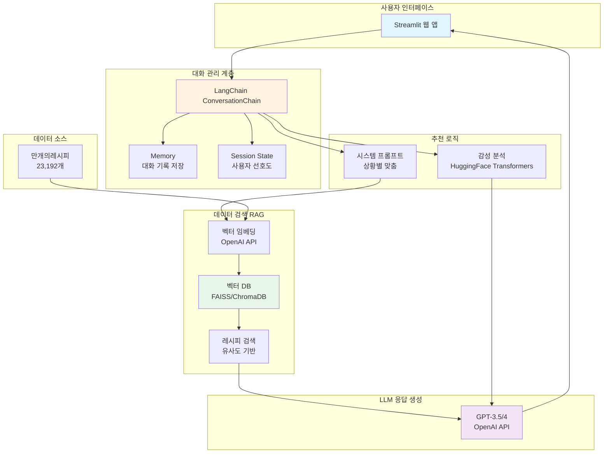
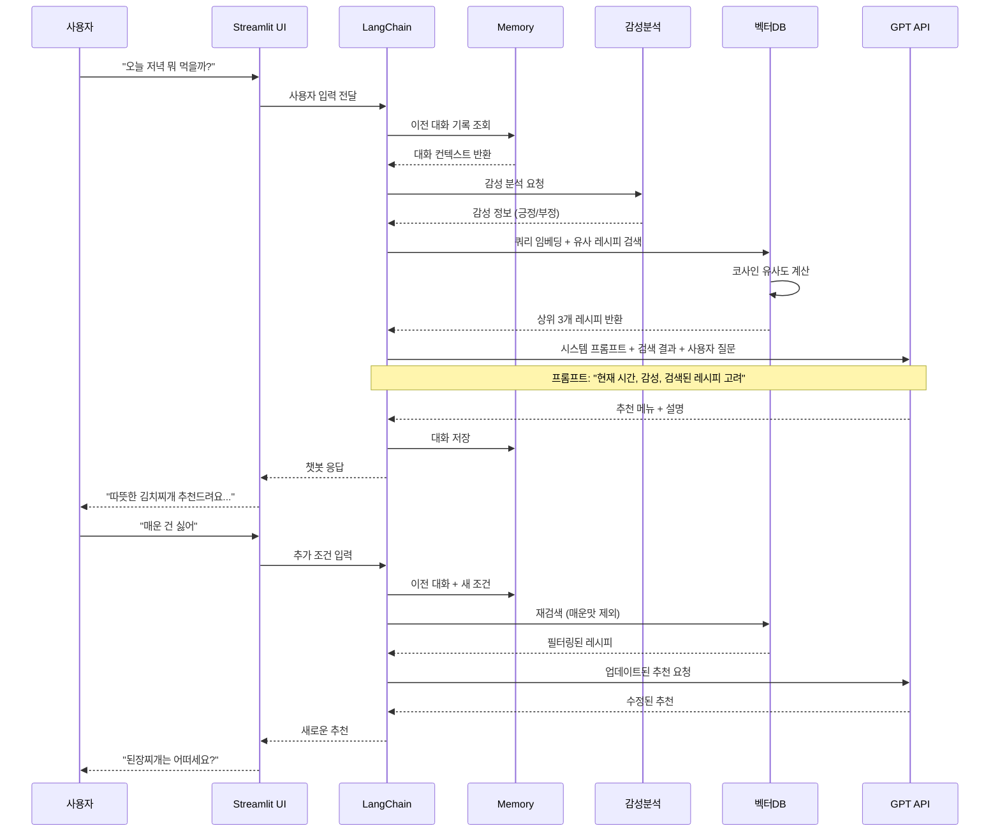
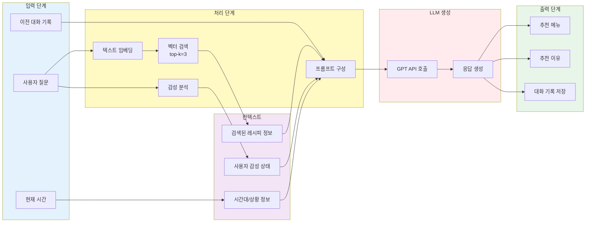

# 프로젝트 중간보고서

## 1. 프로젝트 개요 *필수작성

* 수행 학기:  2025학년 2학기
* 프로젝트명: 메뉴 추천 챗봇 만들기
* 작성날짜: 2025년 11월 11일

구분 | 성명 | 학번 | 소속학과 | 깃허브 아이디
------|-------|-------|-------|-------
1 | 김진형 | 20201708 | 데이터사이언스학과 | hsmu-jinhyeong      
2 | 한영재 | 20191717 | 데이터사이언스학과 | yjh111172        
3 | 양인규 |         | 데이터사이언스학과  | Inkyu-Yang356
4 | 김규민 |         | 데이터사이언스학과  | KIMGM535

* 지도교수: 데이터사이언스학과 김정   

## 2. 프로젝트 내용

### 2.1 서론

본 프로젝트의 주제는 LLM(Large Language Model)을 활용한 메뉴 추천 챗봇(Menu Recommendation Chatbot) 개발입니다.

최근 ChatGPT, Claude, Gemini 등 대형 언어 모델(LLM)의 발전으로 사람과 자연스러운 대화를 통해 맞춤형 추천을 제공하는 시스템이 가능해졌습니다.

본 프로젝트는 사용자의 대화 문맥을 이해하고, 사용자의 기분, 상황, 식습관, 선호 음식 등을 고려하여 메뉴를 추천해주는 대화형 챗봇을 구현하는 것을 목표로 합니다.

이 챗봇은 단순히 랜덤 추천을 하는 것이 아니라, 사용자의 입력 문장으로부터 의미를 분석하고 LLM 기반 자연어 처리 모델을 통해 개인화된 메뉴 추천을 수행합니다.

프로젝트 목표 :

LLM을 기반으로 사용자의 대화 의도를 분석

사용자의 취향, 기분, 식사 시간대 등을 고려한 메뉴 추천

간단한 대화형 인터페이스(UI 또는 콘솔) 제공

향후 확장 시, 음식점 데이터베이스나 API(예: 디스코드 등) 연동

### 2.2 추진 배경(자료조사 및 요구분석)  

#### 2.2.1. 개발 배경 및 필요성  *필수작성

현대 사회는 정보 과잉의 시대이며, 메뉴 선택조차 많은 시간이 걸리는 경우가 많습니다,
특히 점심시간이나 회식 자리에서 “뭐 먹을까?”라는 질문은 흔하지만, 개인의 기호와 상황에 맞는 답을 빠르게 찾기 어렵습니다.

기존의 메뉴 추천 앱들은 주로 별점, 지역, 음식 카테고리 필터에 의존하지만, 사용자의 감정 상태나 대화 맥락을 반영하지 못합니다.
따라서 본 프로젝트는 자연어 이해 능력을 가진 LLM을 활용하여 사용자의 대화형 질의에 맞는 개인화된 메뉴를 제시하는 시스템을 개발하고자 합니다.

#### 2.2.2. 선행기술 및 사례 분석  *필수작성

##### 1. 관련 기술 동향

**대화형 AI 기술의 발전**
- ChatGPT, Claude 등 대규모 언어모델(LLM)이 일반에 공개되어 누구나 대화형 AI 활용 가능
- LangChain 프레임워크를 통해 학생 개발자도 쉽게 LLM 기반 애플리케이션 제작 가능
- Streamlit을 활용한 빠른 프로토타입 개발이 가능해져 교육용 프로젝트에 적합

**음식 추천 서비스의 대중화**
- 배달앱의 추천 기능이 일상화되면서 사용자들이 AI 추천에 익숙해짐
- 단순 룰 기반에서 학습 기반 추천으로 발전 중

##### 2. 기존 유사 시스템 분석

** 간단한 추천 시스템들**

| 비교 대상 | 방식 | 장점 | 단점 |
|---------|------|------|------|
| **랜덤 룰렛 앱** | 랜덤 선택 | 빠르고 간단함 | 개인화 없음, 상황 고려 X |
| **ChatGPT 직접 사용** | 자유 대화 | 자연스러운 대화 | 구조화 안됨, 일관성 부족 |
| **설문 기반 추천** | 정적 설문 → 결과 | 명확한 흐름 | 유연성 부족, 재사용 불가 |

** 학습 참고 자료**

- **LangChain 공식 문서** (https://python.langchain.com/)
  - ConversationChain, Memory 기능 활용법
  - 본 프로젝트에서 대화 흐름 관리에 적용 예정

- **Streamlit 튜토리얼** (https://docs.streamlit.io/)
  - 채팅 인터페이스 구현 방법
  - session_state를 통한 대화 기록 관리

- **Do it! LLM을 활용한 AI 에이전트 개발 입문** (이성용, 이지스퍼블리싱, 2024)
  - LangChain 프레임워크 활용법 및 RAG 구현
  - 프롬프트 엔지니어링 기법
  - 본 프로젝트의 시스템 프롬프트 설계 및 대화 관리에 참고

##### 3. 기존 방식의 한계점

**단순 랜덤 선택의 문제**
- 사용자의 현재 상황(시간대, 날씨, 기분)을 전혀 고려하지 못함
- 매번 다른 결과로 신뢰도 낮음

**ChatGPT 직접 사용의 문제**
- 매번 처음부터 상황을 설명해야 함
- 추천 기준이 일관되지 않음
- 개인 선호도를 저장하지 못함

**정적 설문 방식의 문제**
- 정해진 질문만 가능하여 유연성 부족
- 추가 질문이나 조건 변경 어려움

\

### 2.3 목표 및 내용  

#### 2.3.1. 프로젝트 목표  *필수작성

 

#### 2.3.2. 개발 내용  *필수작성

##### 개발 범위 및 구성

**최종 결과물**: LangChain 기반 대화형 메뉴 추천 챗봇 (Streamlit 웹 앱)

**핵심 기능**:
1. 자연어 대화를 통한 메뉴 추천
2. 사용자 상황 인식 (시간, 기분, 선호도)
3. RAG(Retrieval-Augmented Generation) 기반 레시피 검색
4. 대화 기록 유지 및 문맥 파악

**데이터셋**: 만개의레시피 데이터 (23,192개 레시피)
- 레시피명, 재료, 조리방법, 카테고리 등 19개 컬럼
- OpenAI 임베딩을 통한 벡터화
- ChromaDB를 활용한 벡터 DB 구축

##### 시스템 아키텍처 (블록 다이어그램)

##### 시퀀스 다이어그램 (대화 흐름)

##### 상세 처리 흐름 (컴포넌트 관계)

           
           

#### 2.3.4. 개발 환경

##### 학습 환경
* **GPU**: 불필요 (임베딩 생성만 수행, API 사용)
* **RAM**: 16GB

##### 개발 환경

**프로그래밍 언어**
- Python 3.12

**주요 프레임워크 및 라이브러리**
- **LangChain** (v0.1+): 대화 관리, RAG 구현
- **Streamlit**: 웹 UI 구현
- **OpenAI Python SDK**: GPT API, 임베딩 API
- **HuggingFace Transformers**: 감성 분석 모델
- **ChromaDB**: 벡터 데이터베이스
- **pandas**: 데이터 처리
- **tiktoken**: 토큰 계산

**개발 도구**
- VS Code / Jupyter Notebook
- Git (버전 관리)
- Anaconda (가상환경)

**API 및 서비스**
- OpenAI API (GPT-3.5-turbo 또는 GPT-4)
- OpenAI Embeddings (text-embedding-3-small)

#### 2.3.5. 결과 *필수작성

### 2.4  기대효과  

사용자 편의성: 메뉴 선택에 걸리는 시간을 단축

감정 기반 개인화: 사용자 감정에 맞춘 자연스러운 추천

비즈니스 측면: 향후 음식 배달 서비스와 연동 시, 광고 또는 상권 추천 가능

교육적 효과: LLM 활용 경험, API 연동, 자연어 처리 실습을 통한 AI 응용 능력 향상
 

### 2.5  향후 계획 (프로젝트 일정) *필수작성

### 2.6 역할 분담

구분 | 성명 | 팀내 역할 
:----:|:-----:|-------
1 | 김진형 |  
2 | 한영재 |         
3 | 양인규 |         
3 | 김규민 | 
### 2.7 참고문헌  
 
